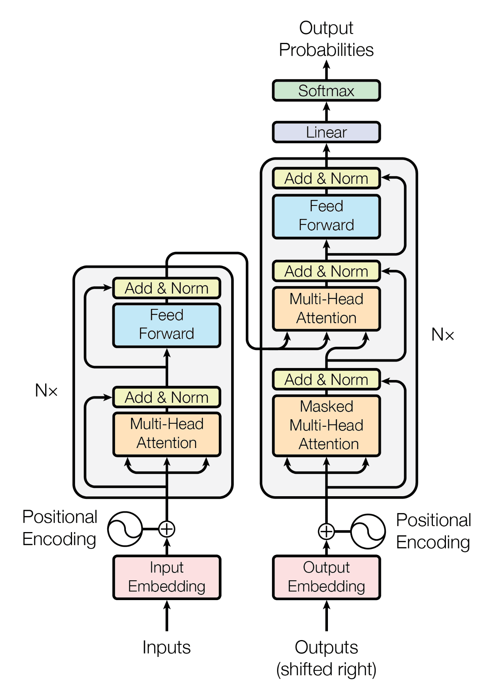

# Neural-Machine-Translation

Neural machine translation from English to Vietnamese written in Tensorflow.**(Transformer model)**

## Setup

```bash
pip install transformers
apt install --allow-change-held-packages libcudnn8=8.1.0.77-1+cuda11.2
pip uninstall -y -q tensorflow keras tensorflow-estimator tensorflow-text
pip install protobuf~=3.20.3
pip install -q tensorflow_datasets
pip install -q -U tensorflow-text tensorflow
pip install einops
pip install wget
pip install datasets
```
## Prepare data

1. Load data:
Use data from [dataset Hugging Face](https://huggingface.co/docs/datasets/index)

```python
from datasets import load_dataset
dataset = load_dataset("mt_eng_vietnamese", "iwslt2015-vi-en")
```
2. Tokenzer:
```python
vietnamese_tokenizer = BertTokenizer.from_pretrained("NlpHUST/vibert4news-base-cased")
english_tokenizer = BertTokenizer.from_pretrained('bert-base-uncased')
```
3. Convert Dataset to  Dataset of Tensorflow

```python
tf_train_data = tf.data.Dataset.from_generator(pipeline_dataset, output_signature=(
     (tf.TensorSpec(shape = (batch_size, None) , dtype=tf.int32),
     tf.TensorSpec(shape = (batch_size , None) , dtype=tf.int32)),
     tf.TensorSpec(shape = (batch_size , None) , dtype=tf.int32)
))
tf_val_data = tf.data.Dataset.from_generator(pipeline_dataset_val, output_signature=(
     (tf.TensorSpec(shape = (batch_size, None) , dtype=tf.int32),
     tf.TensorSpec(shape = (batch_size , None) , dtype=tf.int32)),
     tf.TensorSpec(shape = (batch_size , None) , dtype=tf.int32)
))
```
## Define the components
  1. The embedding and positional encoding layer
  2. The encoder:
      - The self attention 
      - The feed forward network
  3. The decoder:
      - The causal self attention
      - The cross attention layer
      - The feed forward network
## Transformer model
  

```python
class Transformers(Model):
  def __init__(self, *, num_layers, d_model, num_heads,
               dff, input_vocab_size, target_vocab_size, dropout_rate=0.1 ):
    super().__init__()
    self.Encoder = Encoder(num_layers=num_layers, d_model = d_model , num_heads= num_heads , dff = dff , vocab_size= input_vocab_size ,dropout_rate= dropout_rate)
    self.Decoder = Decoder(num_layers=num_layers, d_model = d_model , num_heads= num_heads , dff = dff , vocab_size= target_vocab_size ,dropout_rate= dropout_rate)
    self.Final_layer = Dense(target_vocab_size)
  def call(self , inputs):
    context , x = inputs
    context = self.Encoder(context)
    x = self.Decoder(x , context)
    logits = self.Final_layer(x)
    try:
      del logits._keras_mask
    except:
      pass

    return logits
```
Transformers model:


## Training model
1. Set up the optimizer:
```python
class CustomSchedule(LearningRateSchedule):
  def __init__(self , d_model , warmup_steps = 4000):
    super().__init__()
    self.d_model = tf.cast(d_model , tf.float32)
    self.warmup_steps = warmup_steps
  def __call__(self , step):
    step = tf.cast(step, dtype=tf.float32)
    arg1 = tf.math.rsqrt(step)
    arg2 = step * (self.warmup_steps ** -1.5)

    return tf.math.rsqrt(self.d_model) * tf.math.minimum(arg1, arg2)
```

2. Set up the loss and metrics
```python
def masked_loss(label, pred):
  mask = label != 0
  loss_object = tf.keras.losses.SparseCategoricalCrossentropy(
    from_logits=True, reduction='none')
  loss = loss_object(label, pred)

  mask = tf.cast(mask, dtype=loss.dtype)
  loss *= mask

  loss = tf.reduce_sum(loss)/tf.reduce_sum(mask)
  return loss


def masked_accuracy(label, pred):
  pred = tf.argmax(pred, axis=2)
  label = tf.cast(label, pred.dtype)
  match = label == pred

  mask = label != 0

  match = match & mask

  match = tf.cast(match, dtype=tf.float32)
  mask = tf.cast(mask, dtype=tf.float32)
  return tf.reduce_sum(match)/tf.reduce_sum(mask)
```

3. fit:
```python
transformer.fit(tf_train_data,
                epochs=20, verbose = 1 ,
                validation_data = tf_val_data,
                callbacks = [model_checkpoint_callback , earlyStop]
                )
```


## Minimum Bayes-Risk Decoding
- weighted avg overlap
```python
def weighted_avg_overlap(similarity_fn, samples, log_probs):
    # initialize dictionary
    scores = {}
    # run a for loop for each sample
    for index_candidate, candidate in enumerate(samples):
        # initialize overlap and weighted sum
        overlap, weight_sum = 0.0, 0.0
        # run a for loop for each sample
        for index_sample, (sample, logp) in enumerate(zip(samples, log_probs)):
            # skip if the candidate index is the same as the sample index
            if index_candidate == index_sample:
                continue
            # convert log probability to linear scale
            sample_p = float(np.exp(logp))
            # update the weighted sum
            weight_sum += sample_p
            # get the unigram overlap between candidate and sample
            sample_overlap = similarity_fn(candidate, sample)
            # update the overlap
            overlap += sample_p * sample_overlap
        # get the score for the candidate
        score = overlap / weight_sum
        # save the score in the dictionary. use index as the key.
        scores[index_candidate] = score
    return scores
```
### result
|STT|Input|Ouput|
|---|-----|-----|
|1|What is your name ?|Tên của bạn là gì?|
|2|this is a problem we have to solve .|Đây là vấn đề chúng ta phải giải quyết.|
|3|You are almost done the assignment!|Bạn gần như đã làm được bài tập!|
|4|so i will just share with you some stories very quickly of some magical things that have happened.|Tôi sẽ chia sẻ với các bạn một vài câu chuyện rất nhanh chóng về một số điều kỳ diệu đã xảy ra.|